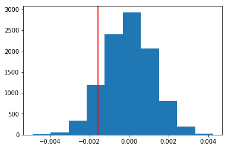

## Analyze A/B Test Results


## Table of Contents
- [Introduction](#intro)
- [Part I - Probability](#probability)
- [Part II - A/B Test](#ab_test)
- [Part III - Regression](#regression)


<a id='intro'></a>
### Introduction

For this project, an A/B test will be performed on an e-commerce website and the goal is to work through this notebook to help the company understand if they should implement the new page, keep the old page, or perhaps run the experiment longer to make their decision.

<a id='probability'></a>
#### Part I - Probability

To get started, let's import our libraries.


```python
import pandas as pd
import numpy as np
import random
import matplotlib.pyplot as plt
%matplotlib inline

#We are setting the seed to assure you get the same answers on quizzes as we set up
random.seed(42)
```

`1.` Now, read in the `ab_data.csv` data. Store it in `df`.  **Use your dataframe to answer the questions in Quiz 1 of the classroom.**

a. Read in the dataset and take a look at the top few rows here:


```python
df = pd.read_csv('ab_data.csv')
df.head()
```


<div>
<style scoped>
    .dataframe tbody tr th:only-of-type {
        vertical-align: middle;
    }

    .dataframe tbody tr th {
        vertical-align: top;
    }

    .dataframe thead th {
        text-align: right;
    }
</style>
<table border="1" class="dataframe">
  <thead>
    <tr style="text-align: right;">
      <th></th>
      <th>user_id</th>
      <th>timestamp</th>
      <th>group</th>
      <th>landing_page</th>
      <th>converted</th>
    </tr>
  </thead>
  <tbody>
    <tr>
      <th>0</th>
      <td>851104</td>
      <td>2017-01-21 22:11:48.556739</td>
      <td>control</td>
      <td>old_page</td>
      <td>0</td>
    </tr>
    <tr>
      <th>1</th>
      <td>804228</td>
      <td>2017-01-12 08:01:45.159739</td>
      <td>control</td>
      <td>old_page</td>
      <td>0</td>
    </tr>
    <tr>
      <th>2</th>
      <td>661590</td>
      <td>2017-01-11 16:55:06.154213</td>
      <td>treatment</td>
      <td>new_page</td>
      <td>0</td>
    </tr>
    <tr>
      <th>3</th>
      <td>853541</td>
      <td>2017-01-08 18:28:03.143765</td>
      <td>treatment</td>
      <td>new_page</td>
      <td>0</td>
    </tr>
    <tr>
      <th>4</th>
      <td>864975</td>
      <td>2017-01-21 01:52:26.210827</td>
      <td>control</td>
      <td>old_page</td>
      <td>1</td>
    </tr>
  </tbody>
</table>
</div>


b. Use the cell below to find the number of rows in the dataset.


```python
df.shape
```


    (294478, 5)


c. The number of unique users in the dataset.


```python
df['user_id'].nunique()
```


    290584


d. The proportion of users converted.


```python
df['converted'].mean()
```


    0.11965919355605512


e. The number of times the `new_page` and `treatment` don't match.


```python
df[((df['group'] == 'treatment') == (df['landing_page'] == 'new_page')) == False].shape[0]
```


    3893


f. Do any of the rows have missing values?


```python
df.isnull().sum()
```


    user_id         0
    timestamp       0
    group           0
    landing_page    0
    converted       0
    dtype: int64


`2.` For the rows where **treatment** does not match with **new_page** or **control** does not match with **old_page**, we cannot be sure if this row truly received the new or old page.  Use **Quiz 2** in the classroom to figure out how we should handle these rows.  

a. Now use the answer to the quiz to create a new dataset that meets the specifications from the quiz.  Store your new dataframe in **df2**.


```python
df2 = df[((df['group'] == 'treatment') == (df['landing_page'] == 'new_page')) != False]
```


```python
# Double Check all of the correct rows were removed - this should be 0
df2[((df2['group'] == 'treatment') == (df2['landing_page'] == 'new_page')) == False].shape[0]
```


    0


`3.` Use **df2** and the cells below to answer questions for **Quiz3** in the classroom.

a. How many unique **user_id**s are in **df2**?


```python
df2['user_id'].nunique()
```


    290584


b. There is one **user_id** repeated in **df2**.  What is it?


```python
df2[df2.user_id.duplicated()]
```


<div>
<style scoped>
    .dataframe tbody tr th:only-of-type {
        vertical-align: middle;
    }

    .dataframe tbody tr th {
        vertical-align: top;
    }

    .dataframe thead th {
        text-align: right;
    }
</style>
<table border="1" class="dataframe">
  <thead>
    <tr style="text-align: right;">
      <th></th>
      <th>user_id</th>
      <th>timestamp</th>
      <th>group</th>
      <th>landing_page</th>
      <th>converted</th>
    </tr>
  </thead>
  <tbody>
    <tr>
      <th>2893</th>
      <td>773192</td>
      <td>2017-01-14 02:55:59.590927</td>
      <td>treatment</td>
      <td>new_page</td>
      <td>0</td>
    </tr>
  </tbody>
</table>
</div>


c. What is the row information for the repeat **user_id**? 


```python
df2[df2.user_id == 773192]
```


<div>
<style scoped>
    .dataframe tbody tr th:only-of-type {
        vertical-align: middle;
    }

    .dataframe tbody tr th {
        vertical-align: top;
    }

    .dataframe thead th {
        text-align: right;
    }
</style>
<table border="1" class="dataframe">
  <thead>
    <tr style="text-align: right;">
      <th></th>
      <th>user_id</th>
      <th>timestamp</th>
      <th>group</th>
      <th>landing_page</th>
      <th>converted</th>
    </tr>
  </thead>
  <tbody>
    <tr>
      <th>1899</th>
      <td>773192</td>
      <td>2017-01-09 05:37:58.781806</td>
      <td>treatment</td>
      <td>new_page</td>
      <td>0</td>
    </tr>
    <tr>
      <th>2893</th>
      <td>773192</td>
      <td>2017-01-14 02:55:59.590927</td>
      <td>treatment</td>
      <td>new_page</td>
      <td>0</td>
    </tr>
  </tbody>
</table>
</div>


d. Remove **one** of the rows with a duplicate **user_id**, but keep your dataframe as **df2**.


```python
df2.drop(1899, inplace=True)
df2[df2.user_id == 773192]
```

    /opt/conda/lib/python3.6/site-packages/pandas/core/frame.py:3697: SettingWithCopyWarning: 
    A value is trying to be set on a copy of a slice from a DataFrame
    
    See the caveats in the documentation: http://pandas.pydata.org/pandas-docs/stable/indexing.html#indexing-view-versus-copy
      errors=errors)


<div>
<style scoped>
    .dataframe tbody tr th:only-of-type {
        vertical-align: middle;
    }

    .dataframe tbody tr th {
        vertical-align: top;
    }

    .dataframe thead th {
        text-align: right;
    }
</style>
<table border="1" class="dataframe">
  <thead>
    <tr style="text-align: right;">
      <th></th>
      <th>user_id</th>
      <th>timestamp</th>
      <th>group</th>
      <th>landing_page</th>
      <th>converted</th>
    </tr>
  </thead>
  <tbody>
    <tr>
      <th>2893</th>
      <td>773192</td>
      <td>2017-01-14 02:55:59.590927</td>
      <td>treatment</td>
      <td>new_page</td>
      <td>0</td>
    </tr>
  </tbody>
</table>
</div>


`4.` Use **df2** in the cells below to answer the quiz questions related to **Quiz 4** in the classroom.

a. What is the probability of an individual converting regardless of the page they receive?


```python
df2['converted'].mean()
```


    0.11959708724499628


b. Given that an individual was in the `control` group, what is the probability they converted?


```python
control_convert = df2.query('group == "control"')['converted'].mean()
control_convert
```


    0.1203863045004612


c. Given that an individual was in the `treatment` group, what is the probability they converted?


```python
treatment_convert = df2.query('group == "treatment"')['converted'].mean()
treatment_convert
```


    0.11880806551510564


d. What is the probability that an individual received the new page?


```python
(df2['landing_page'] == "new_page").mean()
```


    0.50006194422266881


```python
# Timestamp range of the collected data 
max(df2.timestamp), min(df2.timestamp)
```


    ('2017-01-24 13:41:54.460509', '2017-01-02 13:42:05.378582')


e. Consider your results from parts (a) through (d) above, and explain below whether you think there is sufficient evidence to conclude that the new treatment page leads to more conversions.

**There is no sufficient evidentce to conclude that the new treatment page leads to more conversions, as control group conversion probability is nearly the same as treatment group. And treatment group converted probability is actually slightly less than the control group, while the probability of individual received the new page is 50%.**

<a id='ab_test'></a>
### Part II - A/B Test


These questions are the difficult parts associated with A/B tests in general.  


`1.` For now, consider you need to make the decision just based on all the data provided.  If you want to assume that the old page is better unless the new page proves to be definitely better at a Type I error rate of 5%, what should your null and alternative hypotheses be?  You can state your hypothesis in terms of words or in terms of **$p_{old}$** and **$p_{new}$**, which are the converted rates for the old and new pages.

$H_{0}:$ **$p_{new}$** - **$p_{old}$** ≤ 0; $H_{1}:$ **$p_{new}$** - **$p_{old}$** > 0

`2.` Assume under the null hypothesis, $p_{new}$ and $p_{old}$ both have "true" success rates equal to the **converted** success rate regardless of page - that is $p_{new}$ and $p_{old}$ are equal. Furthermore, assume they are equal to the **converted** rate in **ab_data.csv** regardless of the page. <br><br>


a. What is the **conversion rate** for $p_{new}$ under the null? 


```python
p_new = (df2.converted == 1).mean()
p_new
```


    0.11959708724499628


b. What is the **conversion rate** for $p_{old}$ under the null? <br><br>


```python
p_old = (df2.converted == 1).mean()
p_old
```


    0.11959708724499628


c. What is $n_{new}$, the number of individuals in the treatment group?


```python
n_new = (df2['landing_page'] == "new_page").sum()
n_new
```


    145310


d. What is $n_{old}$, the number of individuals in the control group?


```python
n_old = (df2['landing_page'] == "old_page").sum()
n_old
```


    145274


e. Simulate $n_{new}$ transactions with a conversion rate of $p_{new}$ under the null.  Store these $n_{new}$ 1's and 0's in **new_page_converted**.


```python
new_page_converted = np.random.choice([0, 1], size=n_new, p=[1-p_new, p_new])
new_page_converted
```


    array([0, 1, 0, ..., 0, 0, 0])


f. Simulate $n_{old}$ transactions with a conversion rate of $p_{old}$ under the null.  Store these $n_{old}$ 1's and 0's in **old_page_converted**.


```python
old_page_converted = np.random.choice([0, 1], size=n_old, p=[1-p_old, p_old])
old_page_converted
```


    array([0, 0, 0, ..., 0, 0, 1])


g. Find $p_{new}$ - $p_{old}$ for your simulated values from part (e) and (f).


```python
new_page_converted.mean() - old_page_converted.mean()
```


    -0.0001672488542641265


h. Create 10,000 $p_{new}$ - $p_{old}$ values using the same simulation process you used in parts (a) through (g) above. Store all 10,000 values in a NumPy array called **p_diffs**.


```python
p_diffs = []
for _ in range(10000):
    new_page_converted = np.random.choice([0, 1], size=n_new, p=[(1-p_new), p_new])
    old_page_converted = np.random.choice([0, 1], size=n_old, p=[(1-p_old), p_old])
    p_diffs.append(new_page_converted.mean() - old_page_converted.mean())
```

i. Plot a histogram of the **p_diffs**.  Does this plot look like what you expected?  Use the matching problem in the classroom to assure you fully understand what was computed here.


```python
p_diffs = np.array(p_diffs)
obs_diff = treatment_convert - control_convert
plt.hist(p_diffs);
plt.axvline(x=obs_diff, color='red');
```





j. What proportion of the **p_diffs** are greater than the actual difference observed in **ab_data.csv**?


```python
(p_diffs > obs_diff).mean()
```


    0.90159999999999996


k. Please explain using the vocabulary you've learned in this course what you just computed in part **j.**  What is this value called in scientific studies?  What does this value mean in terms of whether or not there is a difference between the new and old pages?
**This value is called p-value in statistics, it represents the probability of obtaining a sample more extreme than the ones observed in our data, assuming null hypothesis is True. Since this is a right tail test with type I error rate (α) of 0.05 and p-value is 0.9, p-value is greater than α, we fail to reject null hypothesis, which means There is no sufficient evidence to conclude there is converted probability difference between the new and old pages.**

l. We could also use a built-in to achieve similar results.  Though using the built-in might be easier to code, the above portions are a walkthrough of the ideas that are critical to correctly thinking about statistical significance. Fill in the below to calculate the number of conversions for each page, as well as the number of individuals who received each page. Let `n_old` and `n_new` refer the the number of rows associated with the old page and new pages, respectively.


```python
import statsmodels.api as sm

convert_old = df2.query('landing_page == "old_page"')['converted'].sum()
convert_new = df2.query('landing_page == "new_page"')['converted'].sum()
n_old = (df2['landing_page'] == "old_page").sum()
n_new = (df2['landing_page'] == "new_page").sum()
convert_old, convert_new, n_old, n_new
```


    (17489, 17264, 145274, 145310)


m. Now use `stats.proportions_ztest` to compute your test statistic and p-value.  [Here](https://docs.w3cub.com/statsmodels/generated/statsmodels.stats.proportion.proportions_ztest/) is a helpful link on using the built in.


```python
z_score, p_value = sm.stats.proportions_ztest([convert_new, convert_old], [n_new, n_old], alternative='larger')
z_score, p_value
```


    (-1.3109241984234394, 0.90505831275902449)


n. What do the z-score and p-value you computed in the previous question mean for the conversion rates of the old and new pages?  Do they agree with the findings in parts **j.** and **k.**?

**z-score is the deviation from the mean in units of standard deviation; p-value is the probability of obtaining a sample more extreme than the ones observed in our data when the null hypothesis is true. Based on z-score, we can get the corresponding p-value (normally from z-test table) and from there, p-value of 0.9 could be captured. P-value of 0.9 is greater than the given α, 0.05, thus, we fail to reject the null hypothesis that new pages have better conversion rates than new pages. With the same p-value computed in parts j. and k., 0.9, the findings are agree with each other.**

<a id='regression'></a>
### Part III - A regression approach

`1.` In this final part, you will see that the result you achieved in the A/B test in Part II above can also be achieved by performing regression.<br><br> 

a. Since each row is either a conversion or no conversion, what type of regression should you be performing in this case?

**Logistic regression should be performed as it predicts a probability between 0 and 1.**

b. The goal is to use **statsmodels** to fit the regression model you specified in part **a.** to see if there is a significant difference in conversion based on which page a customer receives. However, you first need to create in df2 a column for the intercept, and create a dummy variable column for which page each user received.  Add an **intercept** column, as well as an **ab_page** column, which is 1 when an individual receives the **treatment** and 0 if **control**.


```python
df2['intercept'] = 1
df2['ab_page'] = pd.get_dummies(df2['group'])['treatment']
df2.head()
```

    /opt/conda/lib/python3.6/site-packages/ipykernel_launcher.py:1: SettingWithCopyWarning: 
    A value is trying to be set on a copy of a slice from a DataFrame.
    Try using .loc[row_indexer,col_indexer] = value instead
    
    See the caveats in the documentation: http://pandas.pydata.org/pandas-docs/stable/indexing.html#indexing-view-versus-copy
      """Entry point for launching an IPython kernel.
    /opt/conda/lib/python3.6/site-packages/ipykernel_launcher.py:2: SettingWithCopyWarning: 
    A value is trying to be set on a copy of a slice from a DataFrame.
    Try using .loc[row_indexer,col_indexer] = value instead
    
    See the caveats in the documentation: http://pandas.pydata.org/pandas-docs/stable/indexing.html#indexing-view-versus-copy
      


<div>
<style scoped>
    .dataframe tbody tr th:only-of-type {
        vertical-align: middle;
    }

    .dataframe tbody tr th {
        vertical-align: top;
    }

    .dataframe thead th {
        text-align: right;
    }
</style>
<table border="1" class="dataframe">
  <thead>
    <tr style="text-align: right;">
      <th></th>
      <th>user_id</th>
      <th>timestamp</th>
      <th>group</th>
      <th>landing_page</th>
      <th>converted</th>
      <th>intercept</th>
      <th>ab_page</th>
    </tr>
  </thead>
  <tbody>
    <tr>
      <th>0</th>
      <td>851104</td>
      <td>2017-01-21 22:11:48.556739</td>
      <td>control</td>
      <td>old_page</td>
      <td>0</td>
      <td>1</td>
      <td>0</td>
    </tr>
    <tr>
      <th>1</th>
      <td>804228</td>
      <td>2017-01-12 08:01:45.159739</td>
      <td>control</td>
      <td>old_page</td>
      <td>0</td>
      <td>1</td>
      <td>0</td>
    </tr>
    <tr>
      <th>2</th>
      <td>661590</td>
      <td>2017-01-11 16:55:06.154213</td>
      <td>treatment</td>
      <td>new_page</td>
      <td>0</td>
      <td>1</td>
      <td>1</td>
    </tr>
    <tr>
      <th>3</th>
      <td>853541</td>
      <td>2017-01-08 18:28:03.143765</td>
      <td>treatment</td>
      <td>new_page</td>
      <td>0</td>
      <td>1</td>
      <td>1</td>
    </tr>
    <tr>
      <th>4</th>
      <td>864975</td>
      <td>2017-01-21 01:52:26.210827</td>
      <td>control</td>
      <td>old_page</td>
      <td>1</td>
      <td>1</td>
      <td>0</td>
    </tr>
  </tbody>
</table>
</div>


c. Use **statsmodels** to instantiate your regression model on the two columns you created in part b., then fit the model using the two columns you created in part **b.** to predict whether or not an individual converts. 


```python
log_mod = sm.Logit(df2['converted'], df2[['intercept',  'ab_page']])
results = log_mod.fit()
```

    Optimization terminated successfully.
             Current function value: 0.366118
             Iterations 6


d. Provide the summary of your model below, and use it as necessary to answer the following questions.


```python
from scipy import stats
stats.chisqprob = lambda chisq, df: stats.chi2.sf(chisq, df)
results.summary()
```


<table class="simpletable">
<caption>Logit Regression Results</caption>
<tr>
  <th>Dep. Variable:</th>     <td>converted</td>    <th>  No. Observations:  </th>   <td>290584</td>   
</tr>
<tr>
  <th>Model:</th>               <td>Logit</td>      <th>  Df Residuals:      </th>   <td>290582</td>   
</tr>
<tr>
  <th>Method:</th>               <td>MLE</td>       <th>  Df Model:          </th>   <td>     1</td>   
</tr>
<tr>
  <th>Date:</th>          <td>Thu, 27 Aug 2020</td> <th>  Pseudo R-squ.:     </th>  <td>8.077e-06</td> 
</tr>
<tr>
  <th>Time:</th>              <td>03:36:59</td>     <th>  Log-Likelihood:    </th> <td>-1.0639e+05</td>
</tr>
<tr>
  <th>converged:</th>           <td>True</td>       <th>  LL-Null:           </th> <td>-1.0639e+05</td>
</tr>
<tr>
  <th> </th>                      <td> </td>        <th>  LLR p-value:       </th>   <td>0.1899</td>   
</tr>
</table>
<table class="simpletable">
<tr>
      <td></td>         <th>coef</th>     <th>std err</th>      <th>z</th>      <th>P>|z|</th>  <th>[0.025</th>    <th>0.975]</th>  
</tr>
<tr>
  <th>intercept</th> <td>   -1.9888</td> <td>    0.008</td> <td> -246.669</td> <td> 0.000</td> <td>   -2.005</td> <td>   -1.973</td>
</tr>
<tr>
  <th>ab_page</th>   <td>   -0.0150</td> <td>    0.011</td> <td>   -1.311</td> <td> 0.190</td> <td>   -0.037</td> <td>    0.007</td>
</tr>
</table>


e. What is the p-value associated with **ab_page**? Why does it differ from the value you found in **Part II**?<br><br>  

**P-value associated with ab_page is 0.19, which is higher than 0.05, it means ab_page does not have impact on predicting the conversion rates. Part II model null hypothesis assumes that the old page is significantly better than the new page in terms of conversion rate; Part III model is used to examine the association of independent variable (ab_page) with dependent variable (converted) to see if conversion rate will change with ab_page, for example, null hypothesis is: when ab_page is 0, converted = 1 and the alternative hypothesis: when ab_page = 0, converted = 0.**

f. Now, you are considering other things that might influence whether or not an individual converts.  Discuss why it is a good idea to consider other factors to add into your regression model.  Are there any disadvantages to adding additional terms into your regression model?

**Adding in more factors or adopting multiple regression model is more accurate in prediction than simple regression model. There are factors such as features of users, age, country, occupation etc. that might also influence the outcome of prediction. It also helps us to fit the estimated lines better.**

**There are also potential problems associated with Multiple Linear Regression, when adding in new factors we need to identify whether any of the following problems exists and address them accordingly:**

1. Non-linearity of the response-predictor relationships
2. Correlation of error terms
3. Non-constant Variance and Normally Distributed Errors
4. Outliers/ High leverage points
5. Multicollinearity

g. Now along with testing if the conversion rate changes for different pages, also add an effect based on which country a user lives in. You will need to read in the **countries.csv** dataset and merge together your datasets on the appropriate rows.  [Here](https://pandas.pydata.org/pandas-docs/stable/generated/pandas.DataFrame.join.html) are the docs for joining tables. 


```python
df_countries = pd.read_csv('countries.csv')
df_countries.head()
```


<div>
<style scoped>
    .dataframe tbody tr th:only-of-type {
        vertical-align: middle;
    }

    .dataframe tbody tr th {
        vertical-align: top;
    }

    .dataframe thead th {
        text-align: right;
    }
</style>
<table border="1" class="dataframe">
  <thead>
    <tr style="text-align: right;">
      <th></th>
      <th>user_id</th>
      <th>country</th>
    </tr>
  </thead>
  <tbody>
    <tr>
      <th>0</th>
      <td>834778</td>
      <td>UK</td>
    </tr>
    <tr>
      <th>1</th>
      <td>928468</td>
      <td>US</td>
    </tr>
    <tr>
      <th>2</th>
      <td>822059</td>
      <td>UK</td>
    </tr>
    <tr>
      <th>3</th>
      <td>711597</td>
      <td>UK</td>
    </tr>
    <tr>
      <th>4</th>
      <td>710616</td>
      <td>UK</td>
    </tr>
  </tbody>
</table>
</div>


```python
df3 = df_countries.set_index('user_id').join(df2.set_index('user_id'), how='inner')
df3.head()
```


<div>
<style scoped>
    .dataframe tbody tr th:only-of-type {
        vertical-align: middle;
    }

    .dataframe tbody tr th {
        vertical-align: top;
    }

    .dataframe thead th {
        text-align: right;
    }
</style>
<table border="1" class="dataframe">
  <thead>
    <tr style="text-align: right;">
      <th></th>
      <th>country</th>
      <th>timestamp</th>
      <th>group</th>
      <th>landing_page</th>
      <th>converted</th>
      <th>intercept</th>
      <th>ab_page</th>
    </tr>
    <tr>
      <th>user_id</th>
      <th></th>
      <th></th>
      <th></th>
      <th></th>
      <th></th>
      <th></th>
      <th></th>
    </tr>
  </thead>
  <tbody>
    <tr>
      <th>834778</th>
      <td>UK</td>
      <td>2017-01-14 23:08:43.304998</td>
      <td>control</td>
      <td>old_page</td>
      <td>0</td>
      <td>1</td>
      <td>0</td>
    </tr>
    <tr>
      <th>928468</th>
      <td>US</td>
      <td>2017-01-23 14:44:16.387854</td>
      <td>treatment</td>
      <td>new_page</td>
      <td>0</td>
      <td>1</td>
      <td>1</td>
    </tr>
    <tr>
      <th>822059</th>
      <td>UK</td>
      <td>2017-01-16 14:04:14.719771</td>
      <td>treatment</td>
      <td>new_page</td>
      <td>1</td>
      <td>1</td>
      <td>1</td>
    </tr>
    <tr>
      <th>711597</th>
      <td>UK</td>
      <td>2017-01-22 03:14:24.763511</td>
      <td>control</td>
      <td>old_page</td>
      <td>0</td>
      <td>1</td>
      <td>0</td>
    </tr>
    <tr>
      <th>710616</th>
      <td>UK</td>
      <td>2017-01-16 13:14:44.000513</td>
      <td>treatment</td>
      <td>new_page</td>
      <td>0</td>
      <td>1</td>
      <td>1</td>
    </tr>
  </tbody>
</table>
</div>


```python
df3['country'].unique()
```


    array(['UK', 'US', 'CA'], dtype=object)


```python
df3[['CA', 'UK', 'US']] = pd.get_dummies(df3['country'])
df3.head()
```


<div>
<style scoped>
    .dataframe tbody tr th:only-of-type {
        vertical-align: middle;
    }

    .dataframe tbody tr th {
        vertical-align: top;
    }

    .dataframe thead th {
        text-align: right;
    }
</style>
<table border="1" class="dataframe">
  <thead>
    <tr style="text-align: right;">
      <th></th>
      <th>country</th>
      <th>timestamp</th>
      <th>group</th>
      <th>landing_page</th>
      <th>converted</th>
      <th>intercept</th>
      <th>ab_page</th>
      <th>CA</th>
      <th>UK</th>
      <th>US</th>
    </tr>
    <tr>
      <th>user_id</th>
      <th></th>
      <th></th>
      <th></th>
      <th></th>
      <th></th>
      <th></th>
      <th></th>
      <th></th>
      <th></th>
      <th></th>
    </tr>
  </thead>
  <tbody>
    <tr>
      <th>834778</th>
      <td>UK</td>
      <td>2017-01-14 23:08:43.304998</td>
      <td>control</td>
      <td>old_page</td>
      <td>0</td>
      <td>1</td>
      <td>0</td>
      <td>0</td>
      <td>1</td>
      <td>0</td>
    </tr>
    <tr>
      <th>928468</th>
      <td>US</td>
      <td>2017-01-23 14:44:16.387854</td>
      <td>treatment</td>
      <td>new_page</td>
      <td>0</td>
      <td>1</td>
      <td>1</td>
      <td>0</td>
      <td>0</td>
      <td>1</td>
    </tr>
    <tr>
      <th>822059</th>
      <td>UK</td>
      <td>2017-01-16 14:04:14.719771</td>
      <td>treatment</td>
      <td>new_page</td>
      <td>1</td>
      <td>1</td>
      <td>1</td>
      <td>0</td>
      <td>1</td>
      <td>0</td>
    </tr>
    <tr>
      <th>711597</th>
      <td>UK</td>
      <td>2017-01-22 03:14:24.763511</td>
      <td>control</td>
      <td>old_page</td>
      <td>0</td>
      <td>1</td>
      <td>0</td>
      <td>0</td>
      <td>1</td>
      <td>0</td>
    </tr>
    <tr>
      <th>710616</th>
      <td>UK</td>
      <td>2017-01-16 13:14:44.000513</td>
      <td>treatment</td>
      <td>new_page</td>
      <td>0</td>
      <td>1</td>
      <td>1</td>
      <td>0</td>
      <td>1</td>
      <td>0</td>
    </tr>
  </tbody>
</table>
</div>


```python
log_mod = sm.Logit(df3['converted'], df3[['intercept',  'ab_page', 'CA', 'UK']])
results = log_mod.fit()
results.summary()
```

    Optimization terminated successfully.
             Current function value: 0.366113
             Iterations 6


<table class="simpletable">
<caption>Logit Regression Results</caption>
<tr>
  <th>Dep. Variable:</th>     <td>converted</td>    <th>  No. Observations:  </th>   <td>290584</td>   
</tr>
<tr>
  <th>Model:</th>               <td>Logit</td>      <th>  Df Residuals:      </th>   <td>290580</td>   
</tr>
<tr>
  <th>Method:</th>               <td>MLE</td>       <th>  Df Model:          </th>   <td>     3</td>   
</tr>
<tr>
  <th>Date:</th>          <td>Thu, 27 Aug 2020</td> <th>  Pseudo R-squ.:     </th>  <td>2.323e-05</td> 
</tr>
<tr>
  <th>Time:</th>              <td>03:37:03</td>     <th>  Log-Likelihood:    </th> <td>-1.0639e+05</td>
</tr>
<tr>
  <th>converged:</th>           <td>True</td>       <th>  LL-Null:           </th> <td>-1.0639e+05</td>
</tr>
<tr>
  <th> </th>                      <td> </td>        <th>  LLR p-value:       </th>   <td>0.1760</td>   
</tr>
</table>
<table class="simpletable">
<tr>
      <td></td>         <th>coef</th>     <th>std err</th>      <th>z</th>      <th>P>|z|</th>  <th>[0.025</th>    <th>0.975]</th>  
</tr>
<tr>
  <th>intercept</th> <td>   -1.9893</td> <td>    0.009</td> <td> -223.763</td> <td> 0.000</td> <td>   -2.007</td> <td>   -1.972</td>
</tr>
<tr>
  <th>ab_page</th>   <td>   -0.0149</td> <td>    0.011</td> <td>   -1.307</td> <td> 0.191</td> <td>   -0.037</td> <td>    0.007</td>
</tr>
<tr>
  <th>CA</th>        <td>   -0.0408</td> <td>    0.027</td> <td>   -1.516</td> <td> 0.130</td> <td>   -0.093</td> <td>    0.012</td>
</tr>
<tr>
  <th>UK</th>        <td>    0.0099</td> <td>    0.013</td> <td>    0.743</td> <td> 0.457</td> <td>   -0.016</td> <td>    0.036</td>
</tr>
</table>


**Findings:**
Based on the result summary, all of the variables have p-value greater than 0.05, countries do not have impact on predicting the conversion rates.

h. Though you have now looked at the individual factors of country and page on conversion, we would now like to look at an interaction between page and country to see if there significant effects on conversion.  Create the necessary additional columns, and fit the new model.  

Provide the summary results, and your conclusions based on the results.


```python
df3['CA_page'] = df3['ab_page'] * df3['CA']
df3['UK_page'] = df3['ab_page'] * df3['UK']
df3['US_page'] = df3['ab_page'] * df3['US']
df3.head()
```


<div>
<style scoped>
    .dataframe tbody tr th:only-of-type {
        vertical-align: middle;
    }

    .dataframe tbody tr th {
        vertical-align: top;
    }

    .dataframe thead th {
        text-align: right;
    }
</style>
<table border="1" class="dataframe">
  <thead>
    <tr style="text-align: right;">
      <th></th>
      <th>country</th>
      <th>timestamp</th>
      <th>group</th>
      <th>landing_page</th>
      <th>converted</th>
      <th>intercept</th>
      <th>ab_page</th>
      <th>CA</th>
      <th>UK</th>
      <th>US</th>
      <th>CA_page</th>
      <th>UK_page</th>
      <th>US_page</th>
    </tr>
    <tr>
      <th>user_id</th>
      <th></th>
      <th></th>
      <th></th>
      <th></th>
      <th></th>
      <th></th>
      <th></th>
      <th></th>
      <th></th>
      <th></th>
      <th></th>
      <th></th>
      <th></th>
    </tr>
  </thead>
  <tbody>
    <tr>
      <th>834778</th>
      <td>UK</td>
      <td>2017-01-14 23:08:43.304998</td>
      <td>control</td>
      <td>old_page</td>
      <td>0</td>
      <td>1</td>
      <td>0</td>
      <td>0</td>
      <td>1</td>
      <td>0</td>
      <td>0</td>
      <td>0</td>
      <td>0</td>
    </tr>
    <tr>
      <th>928468</th>
      <td>US</td>
      <td>2017-01-23 14:44:16.387854</td>
      <td>treatment</td>
      <td>new_page</td>
      <td>0</td>
      <td>1</td>
      <td>1</td>
      <td>0</td>
      <td>0</td>
      <td>1</td>
      <td>0</td>
      <td>0</td>
      <td>1</td>
    </tr>
    <tr>
      <th>822059</th>
      <td>UK</td>
      <td>2017-01-16 14:04:14.719771</td>
      <td>treatment</td>
      <td>new_page</td>
      <td>1</td>
      <td>1</td>
      <td>1</td>
      <td>0</td>
      <td>1</td>
      <td>0</td>
      <td>0</td>
      <td>1</td>
      <td>0</td>
    </tr>
    <tr>
      <th>711597</th>
      <td>UK</td>
      <td>2017-01-22 03:14:24.763511</td>
      <td>control</td>
      <td>old_page</td>
      <td>0</td>
      <td>1</td>
      <td>0</td>
      <td>0</td>
      <td>1</td>
      <td>0</td>
      <td>0</td>
      <td>0</td>
      <td>0</td>
    </tr>
    <tr>
      <th>710616</th>
      <td>UK</td>
      <td>2017-01-16 13:14:44.000513</td>
      <td>treatment</td>
      <td>new_page</td>
      <td>0</td>
      <td>1</td>
      <td>1</td>
      <td>0</td>
      <td>1</td>
      <td>0</td>
      <td>0</td>
      <td>1</td>
      <td>0</td>
    </tr>
  </tbody>
</table>
</div>


```python
log_mod = sm.Logit(df3['converted'], df3[['intercept', 'CA_page', 'UK_page']])
results = log_mod.fit()
results.summary()
```

    Optimization terminated successfully.
             Current function value: 0.366113
             Iterations 6


<table class="simpletable">
<caption>Logit Regression Results</caption>
<tr>
  <th>Dep. Variable:</th>     <td>converted</td>    <th>  No. Observations:  </th>   <td>290584</td>   
</tr>
<tr>
  <th>Model:</th>               <td>Logit</td>      <th>  Df Residuals:      </th>   <td>290581</td>   
</tr>
<tr>
  <th>Method:</th>               <td>MLE</td>       <th>  Df Model:          </th>   <td>     2</td>   
</tr>
<tr>
  <th>Date:</th>          <td>Thu, 27 Aug 2020</td> <th>  Pseudo R-squ.:     </th>  <td>2.364e-05</td> 
</tr>
<tr>
  <th>Time:</th>              <td>03:37:07</td>     <th>  Log-Likelihood:    </th> <td>-1.0639e+05</td>
</tr>
<tr>
  <th>converged:</th>           <td>True</td>       <th>  LL-Null:           </th> <td>-1.0639e+05</td>
</tr>
<tr>
  <th> </th>                      <td> </td>        <th>  LLR p-value:       </th>   <td>0.08085</td>  
</tr>
</table>
<table class="simpletable">
<tr>
      <td></td>         <th>coef</th>     <th>std err</th>      <th>z</th>      <th>P>|z|</th>  <th>[0.025</th>    <th>0.975]</th>  
</tr>
<tr>
  <th>intercept</th> <td>   -1.9963</td> <td>    0.006</td> <td> -322.049</td> <td> 0.000</td> <td>   -2.008</td> <td>   -1.984</td>
</tr>
<tr>
  <th>CA_page</th>   <td>   -0.0752</td> <td>    0.038</td> <td>   -1.997</td> <td> 0.046</td> <td>   -0.149</td> <td>   -0.001</td>
</tr>
<tr>
  <th>UK_page</th>   <td>    0.0149</td> <td>    0.017</td> <td>    0.862</td> <td> 0.389</td> <td>   -0.019</td> <td>    0.049</td>
</tr>
</table>


```python
1/np.exp(results.params)
```


    intercept    7.361591
    CA_page      1.078076
    UK_page      0.985222
    dtype: float64


**Findings:**
1. P-values for CA_page is less than 0.05, which means that the interation between Canada users and new page is statistically significant in predicting the conversion of users;
2. While holding UK_page constant, the chance of coversion is 1.078 times more likely for CA_page.

<a id='conclusions'></a>
## Conclusion

> For this project, both A/B test and logistiic regression approach were performed on an e-commerce website to help the company understand if they should implement the new page, keep the old page, or perhaps run the experiment longer to make their decision. Based on results from both A/B test and logistic regression model, there is no sufficient evidence to conclude that the new page works better than the old page in terms of conversion rate. 

> As we only analyzed dataset over a relatively short time frame, less than 1 month, it is suggested to run the experiment longer to make decision, especially there are potentially bias results when tested on existing users, due to factors like change aversion and novelty effect. Meanwhile, other factors such as click through rate could also be examined. Finally, practical significance of a conversion rate should also be taken into consideration, for example the cost of launching a new page vs the revenue obtained from the increase in conversion.


```python
from subprocess import call
call(['python', '-m', 'nbconvert', 'Analyze_ab_test_results_notebook.ipynb'])
```


    0


```python

```
